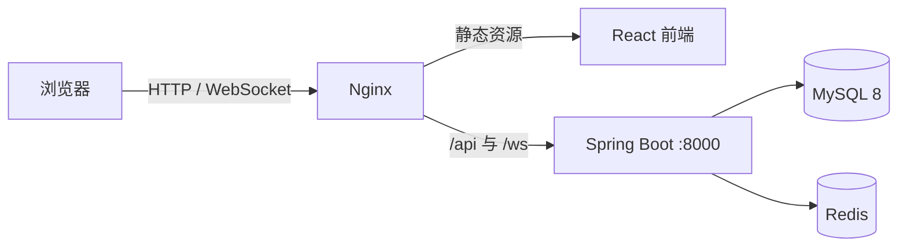

# OpenCollab

OpenCollab 是面向团队内部使用的在线协作文档平台，支持 Markdown、Word 和 Excel 文档的创建、编辑、分享、评论、版本管理与多人实时协作，并内置 AI 办公助手，可解答办公软件、文档写作与数据分析等问题。

## 技术栈

| 层级 | 主要技术 |
| --- | --- |
| 前端 | React 18、TypeScript、Vite、Zustand |
| 文档编辑 | Univer、Milkdown、canvas-editor、Yjs |
| 后端 | Java 8、Spring Boot 2.7、Spring Security、MyBatis-Plus |
| 数据 | MySQL 8、Flyway、Redis |
| 部署 | Docker Compose、Nginx |

## 系统架构



前端通过 REST API 完成登录、文件、权限、评论和版本等业务操作；通过 `/ws/{fileId}?token=...` 建立 Yjs 协作连接。后端使用原始 WebSocket 按文件房间转发协作消息，并通过 MySQL 保存文件、版本和权限数据；Redis 维护已吊销 JWT 的黑名单。

## 目录说明

```text
backend/              Spring Boot API、WebSocket 与 Flyway 迁移脚本
frontend/             React 单页应用与文档编辑器
nginx/                静态资源、API 和 WebSocket 反向代理配置
docker-compose.yml    MySQL、Redis、后端和前端服务编排
```

## Docker 部署

### 1. 获取代码

```bash
git clone -b v2026.07.16 https://github.com/JamesZhaoY/opencollab.git
cd opencollab
```

### 2. 创建环境变量文件

`docker-compose.yml` 会读取根目录的 `.env`。请创建该文件并替换所有示例密码与密钥：

```dotenv
MYSQL_ROOT_PASSWORD=replace-with-a-strong-root-password
DB_NAME=excel_collab
DB_USER=collab_user
DB_PASSWORD=replace-with-a-strong-db-password

JWT_SECRET=replace-with-a-long-random-secret

REDIS_PASSWORD=
APP_ALLOWED_ORIGINS=http://localhost:5173,http://localhost

# AI 助手（可同时配置；在聊天面板中切换）
OLLAMA_BASE_URL=http://host.docker.internal:11434/v1/chat/completions
OLLAMA_MODEL=qwen2.5:3b
AGNES_API_KEY=
AGNES_MODEL=agnes-2.0-flash
```

生产环境务必使用随机的数据库密码和 JWT 密钥，并将 `APP_ALLOWED_ORIGINS` 修改为实际前端域名。

### 3. 构建并启动

```bash
docker compose up -d --build
docker compose ps
```

首次执行会拉取基础镜像并构建前后端。服务正常时，`mysql`、`redis`、`backend` 与 `frontend` 均应为 `Up`，其中 MySQL 状态还应显示 `healthy`。

默认访问地址：

- 前端：`http://localhost`
- 后端 API：`http://localhost:8000/api`
- 后端 WebSocket：`ws://localhost/ws/{fileId}?token=<access_token>`

### 4. 查看日志

```bash
docker compose logs -f backend
docker compose logs -f frontend
docker compose ps
```

## 单镜像离线部署

`deploy/all-in-one/Dockerfile` 将前端、后端、Nginx、MySQL、Redis、Ollama 与本地提供的 Ollama 模型打包到**同一个镜像、同一个容器**中。容器只提供 HTTP `80` 端口；宿主机端口可自由映射。容器内由 Supervisor 管理各进程，不再需要 Docker Compose、外部 MySQL、Redis 或 Nginx。

打包机只需能够从远程拉取基础镜像（含官方 Ollama 运行程序），**不会在构建时联网下载模型**。先将已有 Ollama 模型目录完整复制到项目的 `deploy/all-in-one/models/`；必须保留 `manifests/` 与 `blobs/` 两级目录结构：

```bash
mkdir -p deploy/all-in-one/models
cp -R /本地模型目录/. deploy/all-in-one/models/
```

然后构建镜像：

```bash
docker build \
  -f deploy/all-in-one/Dockerfile \
  -t opencollab-all-in-one:2026.07.16 .
```

以宿主机 `80` 端口启动：

```bash
docker run -d --name opencollab \
  --restart unless-stopped \
  -p 80:80 \
  -e MYSQL_ROOT_PASSWORD='替换为强密码' \
  -e DB_PASSWORD='替换为数据库强密码' \
  -e REDIS_PASSWORD='替换为 Redis 强密码' \
  -e JWT_SECRET='替换为足够长的随机密钥' \
  -e APP_ALLOWED_ORIGINS='http://服务器IP或域名' \
  -e OLLAMA_MODEL='本地模型对应的名称' \
  -v opencollab_mysql:/var/lib/mysql \
  -v opencollab_redis:/var/lib/redis \
  -v opencollab_uploads:/app/uploads \
  -v opencollab_models:/opt/ollama/models \
  opencollab-all-in-one:2026.07.16
```

如需使用自定义端口，只改宿主机侧端口，例如 `-p 8080:80` 后访问 `http://服务器IP:8080`。`MYSQL_ROOT_PASSWORD`、`DB_PASSWORD`、`REDIS_PASSWORD` 与 `JWT_SECRET` 均为必填项；`DB_NAME`（默认 `excel_collab`）和 `DB_USER`（默认 `opencollab`）可按需覆盖。`OLLAMA_MODEL` 必须与复制进来的模型清单名称一致，默认值为 `qwen2.5:3b`。

模型文件会随镜像体积增长。将镜像带入无网络内网时，在打包机导出并在目标服务器导入：

```bash
docker save -o opencollab-all-in-one-2026.07.16.tar opencollab-all-in-one:2026.07.16
# 将 tar 文件传到内网服务器后执行
docker load -i opencollab-all-in-one-2026.07.16.tar
```

首次运行会初始化内置 MySQL 的数据库和账号；四个 Docker volume 必须长期保留，否则重建容器会丢失数据库、Redis 持久化数据、上传文件及模型缓存。升级时使用新镜像重新 `docker run`，并挂载同名 volume 即可保留业务数据。若希望运行时直接使用服务器的本地模型目录，可额外挂载 `-v /本地模型目录:/opt/ollama/models`；该挂载会覆盖镜像内置模型。

## 本地开发

先启动依赖服务：

```bash
docker compose up -d mysql redis
```

后端：

```bash
cd backend
mvn spring-boot:run
```

前端：

```bash
cd frontend
npm install
npm run dev
```

Vite 开发服务器运行在 `5173` 端口，并将 `/api`、`/ws`、`/uploads` 代理到 `127.0.0.1:8000`。

## 协作与保存

- Markdown 使用 Milkdown 提供所见即所得编辑与代码高亮；Word 和 Markdown 的文本协作通过 Yjs 实时同步。
- AI 对话使用 SSE 流式响应；Nginx 禁用流缓冲并将 AI 空闲超时设为 10 分钟，后端模型连接超时为 15 秒、流读取超时为 10 分钟，适配模型较长的思考阶段。
- Excel 日常编辑通过 WebSocket 分发单元格补丁，远端仅更新受影响的单元格；新增、删除或重命名工作表时只调整对应工作表，不会重建整个编辑器组件。
- Excel 单元格锁由 Redis 原子获取并设置 45 秒过期时间；获锁后才会广播“用户名正在编辑 A1”。编辑结束会主动释放，异常断开则自动过期。
- 工作台文件列表批量查询当前用户的权限，避免文件数量增加时产生逐行权限查询；编辑器、管理页与密码页按路由懒加载，降低工作台首屏负载。
- 自动保存只更新当前文档；点击“保存版本”才会生成可恢复的历史快照。下载文件名包含原始文件名、版本号和下载时间。

## 数据库与账号

数据库结构由 Flyway 自动迁移，脚本位于 `backend/src/main/resources/db/migration`。后端同时包含 `flyway-core` 与 `flyway-mysql`，用于支持 MySQL 8。

系统不创建默认管理员。请先在登录页面注册账号；注册用户默认是普通用户。如需授予管理员角色，在 MySQL 容器中执行：

```bash
docker compose exec mysql mysql -u root -p
```

```sql
USE excel_collab;
UPDATE users SET role = 'admin' WHERE username = '<用户名>';
```

## AI 助手

前端提供全局可拖拽的 AI 办公助手悬浮按钮，支持在任意页面发起对话；在文档编辑器等页面会自动把当前文件内容作为上下文一并发送给模型。后端通过 `POST /api/ai/chat` 代理到兼容 OpenAI 的聊天补全接口，API Key 仅保存在服务端，不会暴露给浏览器。

聊天面板可在“本地 Ollama”与“Agnes 2.0 Flash”之间切换；密钥始终只保存在服务端。使用前在 `.env` 中按需配置：

```dotenv
# 本地 Ollama（Ollama 开启 OpenAI 兼容接口后使用；无需 API Key）
OLLAMA_BASE_URL=http://host.docker.internal:11434/v1/chat/completions
OLLAMA_MODEL=qwen2.5:3b

# Agnes 2.0 Flash（必须填写 API Key）
AGNES_BASE_URL=https://apihub.agnes-ai.com/v1/chat/completions
AGNES_API_KEY=your_agnes_api_key
AGNES_MODEL=agnes-2.0-flash
```

说明：

- 后端按聊天面板所选服务调用对应的 OpenAI 兼容端点，Agnes 的 `AGNES_API_KEY` 不会发送给浏览器。
- Agnes 2.0 Flash 使用 `https://apihub.agnes-ai.com/v1/chat/completions`、模型名 `agnes-2.0-flash`，并支持 `stream: true`；本地 Ollama 可留空 API Key。
- 请求体包含固定的企业办公系统提示词与可选的文件上下文，模型仅用于办公相关问题解答。

## 生产部署注意事项


- 为 MySQL、Redis 和上传目录保留 Docker volume，避免容器重建后丢失数据。
- Nginx 配置已包含 WebSocket 升级头；部署 HTTPS 时，浏览器端会自动使用 `wss`。
- 单个上传文件最大为 50 MB。
- 不要将 `.env`、数据库备份或构建产物提交到仓库。
