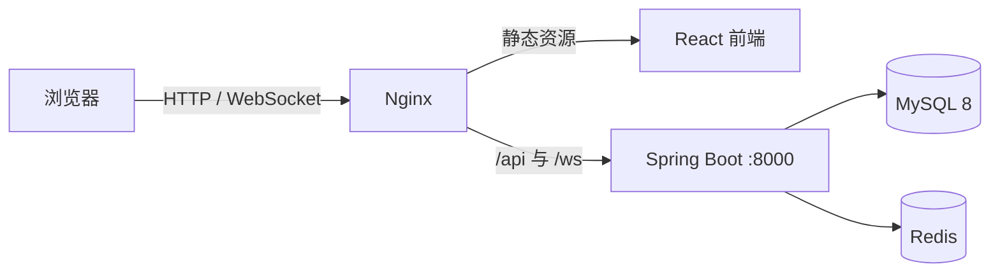

# OpenCollab

OpenCollab 是面向团队内部使用的在线协作文档平台，支持 Markdown、Word 和 Excel 文档的创建、编辑、分享、评论、版本管理与多人实时协作，并内置 AI 办公助手，可解答办公软件、文档写作与数据分析等问题。

## 技术栈

| 层级 | 主要技术 |
| --- | --- |
| 前端 | React 18、TypeScript、Vite、Zustand |
| 文档编辑 | Univer、Milkdown、canvas-editor、Yjs |
| 后端 | Java 8、Spring Boot 2.7、Spring Security、MyBatis-Plus |
| 数据 | MySQL 8、Flyway、Redis |
| 部署 | Docker Compose、Nginx |

## 系统架构



前端通过 REST API 完成登录、文件、权限、评论和版本等业务操作；通过 `/ws/{fileId}?token=...` 建立 Yjs 协作连接。后端使用原始 WebSocket 按文件房间转发协作消息，并通过 MySQL 保存文件、版本和权限数据；Redis 维护已吊销 JWT 的黑名单。

## 目录说明

```text
backend/              Spring Boot API、WebSocket 与 Flyway 迁移脚本
frontend/             React 单页应用与文档编辑器
nginx/                静态资源、API 和 WebSocket 反向代理配置
deploy/intranet/      内网部署的后端配置文件模板
docker-compose.yml    仅用于本地开发的一组依赖服务编排
```

## 内网部署（使用既有 MySQL 与 Redis）

内网环境只需要导入两个镜像：`opencollab-backend` 和 `opencollab-frontend`。MySQL、Redis、Ollama 等服务不包含在镜像内，后端从挂载的配置文件读取它们的地址和凭据。

### 1. 在可联网的打包机构建并导出

```bash
docker build -f backend/Dockerfile -t opencollab-backend:2026.07.16 backend
docker build -f frontend/Dockerfile -t opencollab-frontend:2026.07.16 .
docker save -o opencollab-images-2026.07.16.tar \
  opencollab-backend:2026.07.16 \
  opencollab-frontend:2026.07.16
```

将 `opencollab-images-2026.07.16.tar` 传到内网服务器。

### 2. 在内网服务器准备配置文件

复制 [application.yml.example](deploy/intranet/application.yml.example) 为服务器本地配置文件，并替换 MySQL、Redis、JWT、域名和 AI 服务信息：

```bash
mkdir -p /opt/opencollab/config
cp deploy/intranet/application.yml.example /opt/opencollab/config/application.yml
chmod 600 /opt/opencollab/config/application.yml
```

目标数据库需要预先创建；MySQL 用户需要拥有该库的建表、修改表和读写权限，供 Flyway 首次迁移与正常业务使用；Redis 需允许内网服务器访问。

### 3. 在内网服务器导入并启动

```bash
docker load -i opencollab-images-2026.07.16.tar
docker network create opencollab-net

docker run -d --name opencollab-backend \
  --restart unless-stopped \
  --network opencollab-net \
  --network-alias backend \
  -v /opt/opencollab/config/application.yml:/app/config/application.yml:ro \
  -v opencollab_uploads:/app/uploads \
  opencollab-backend:2026.07.16

docker run -d --name opencollab-frontend \
  --restart unless-stopped \
  --network opencollab-net \
  -p 80:80 \
  opencollab-frontend:2026.07.16
```

如需使用自定义端口，将最后一条命令中的 `-p 80:80` 改为如 `-p 8080:80`。浏览器访问 `http://内网服务器IP:8080`。

`/app/config/application.yml` 会在后端启动时作为外部 Spring 配置加载，实际密码和密钥不进入镜像，也无需设置为 Docker 环境变量。

### 4. 验证与日志

```bash
docker ps --filter name=opencollab
docker logs -f opencollab-backend
docker logs -f opencollab-frontend
```

## 本地开发

先启动依赖服务：

```bash
docker compose up -d mysql redis
```

后端：

```bash
cd backend
mvn spring-boot:run
```

前端：

```bash
cd frontend
npm install
npm run dev
```

Vite 开发服务器运行在 `5173` 端口，并将 `/api`、`/ws`、`/uploads` 代理到 `127.0.0.1:8000`。

## 协作与保存

- Markdown 使用 Milkdown 提供所见即所得编辑与代码高亮；Word 和 Markdown 的文本协作通过 Yjs 实时同步。
- AI 对话使用 SSE 流式响应；Nginx 禁用流缓冲并将 AI 空闲超时设为 10 分钟，后端模型连接超时为 15 秒、流读取超时为 10 分钟，适配模型较长的思考阶段。
- Excel 日常编辑通过 WebSocket 分发单元格补丁，远端仅更新受影响的单元格；新增、删除或重命名工作表时只调整对应工作表，不会重建整个编辑器组件。
- Excel 单元格锁由 Redis 原子获取并设置 45 秒过期时间；获锁后才会广播“用户名正在编辑 A1”。编辑结束会主动释放，异常断开则自动过期。
- 工作台文件列表批量查询当前用户的权限，避免文件数量增加时产生逐行权限查询；编辑器、管理页与密码页按路由懒加载，降低工作台首屏负载。
- 自动保存只更新当前文档；点击“保存版本”才会生成可恢复的历史快照。下载文件名包含原始文件名、版本号和下载时间。

## 数据库与账号

数据库结构由 Flyway 自动迁移，脚本位于 `backend/src/main/resources/db/migration`。后端同时包含 `flyway-core` 与 `flyway-mysql`，用于支持 MySQL 8。

系统不创建默认管理员。请先在登录页面注册账号；注册用户默认是普通用户。如需授予管理员角色，连接既有 MySQL 后执行：

```bash
mysql -h <MySQL地址> -u <管理员账号> -p
```

```sql
USE excel_collab;
UPDATE users SET role = 'admin' WHERE username = '<用户名>';
```

## AI 助手

前端提供全局可拖拽的 AI 办公助手悬浮按钮，支持在任意页面发起对话；在文档编辑器等页面会自动把当前文件内容作为上下文一并发送给模型。后端通过 `POST /api/ai/chat` 代理到兼容 OpenAI 的聊天补全接口，API Key 仅保存在服务端，不会暴露给浏览器。

聊天面板可在“本地 Ollama”与“Agnes 2.0 Flash”之间切换；密钥始终只保存在服务端。内网部署时，在挂载的 `application.yml` 中按需配置：

```yaml
ai:
  ollama:
    base-url: http://ollama.intranet.local:11434/v1/chat/completions
    model: 'qwen2.5:3b'
  agnes:
    api-key: your_agnes_api_key
    model: agnes-2.0-flash
```

说明：

- 后端按聊天面板所选服务调用对应的 OpenAI 兼容端点，Agnes 的 `AGNES_API_KEY` 不会发送给浏览器。
- Agnes 2.0 Flash 使用 `https://apihub.agnes-ai.com/v1/chat/completions`、模型名 `agnes-2.0-flash`，并支持 `stream: true`；本地 Ollama 可留空 API Key。
- 请求体包含固定的企业办公系统提示词与可选的文件上下文，模型仅用于办公相关问题解答。

## 生产部署注意事项


- 为后端上传目录保留 Docker volume，避免容器重建后丢失文件；MySQL 与 Redis 的数据保留策略由既有服务负责。
- Nginx 配置已包含 WebSocket 升级头；部署 HTTPS 时，浏览器端会自动使用 `wss`。
- 单个上传文件最大为 50 MB。
- 不要将 `.env`、数据库备份或构建产物提交到仓库。
