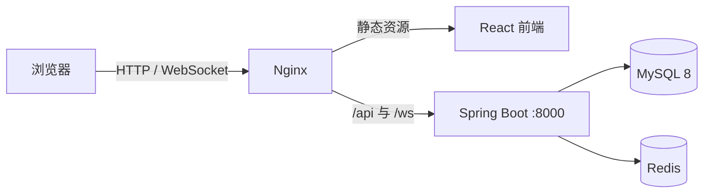

# OpenCollab

OpenCollab 是面向团队内部使用的在线协作文档平台，支持 Markdown、Word 和 Excel 文档的创建、编辑、分享、评论、版本管理与多人实时协作。

## 技术栈

| 层级 | 主要技术 |
| --- | --- |
| 前端 | React 18、TypeScript、Vite、Zustand |
| 文档编辑 | Univer、canvas-editor、Yjs |
| 后端 | Java 8、Spring Boot 2.7、Spring Security、MyBatis-Plus |
| 数据 | MySQL 8、Flyway、Redis |
| 部署 | Docker Compose、Nginx |

## 系统架构



前端通过 REST API 完成登录、文件、权限、评论和版本等业务操作；通过 `/ws/{fileId}?token=...` 建立 Yjs 协作连接。后端使用原始 WebSocket 按文件房间转发协作消息，并通过 MySQL 保存文件、版本和权限数据；Redis 维护已吊销 JWT 的黑名单。

## 目录说明

```text
backend/              Spring Boot API、WebSocket 与 Flyway 迁移脚本
frontend/             React 单页应用与文档编辑器
nginx/                静态资源、API 和 WebSocket 反向代理配置
docker-compose.yml    MySQL、Redis、后端和前端服务编排
```

## Docker 部署

### 1. 获取代码

```bash
git clone -b V1.0 https://github.com/JamesZhaoY/opencollab.git
cd opencollab
```

### 2. 创建环境变量文件

`docker-compose.yml` 会读取根目录的 `.env`。请创建该文件并替换所有示例密码与密钥：

```dotenv
MYSQL_ROOT_PASSWORD=replace-with-a-strong-root-password
DB_NAME=excel_collab
DB_USER=collab_user
DB_PASSWORD=replace-with-a-strong-db-password

JWT_SECRET=replace-with-a-long-random-secret

REDIS_PASSWORD=
APP_ALLOWED_ORIGINS=http://localhost:5173,http://localhost
```

生产环境务必使用随机的数据库密码和 JWT 密钥，并将 `APP_ALLOWED_ORIGINS` 修改为实际前端域名。

### 3. 构建并启动

```bash
docker compose up -d --build
docker compose ps
```

首次执行会拉取基础镜像并构建前后端。服务正常时，`mysql`、`redis`、`backend` 与 `frontend` 均应为 `Up`，其中 MySQL 状态还应显示 `healthy`。

默认访问地址：

- 前端：`http://localhost`
- 后端 API：`http://localhost:8000/api`
- 后端 WebSocket：`ws://localhost/ws/{fileId}?token=<access_token>`

### 4. 查看日志

```bash
docker compose logs -f backend
docker compose logs -f frontend
docker compose ps
```

## 本地开发

先启动依赖服务：

```bash
docker compose up -d mysql redis
```

后端：

```bash
cd backend
mvn spring-boot:run
```

前端：

```bash
cd frontend
npm install
npm run dev
```

Vite 开发服务器运行在 `5173` 端口，并将 `/api`、`/ws`、`/uploads` 代理到 `127.0.0.1:8000`。

## 数据库与账号

数据库结构由 Flyway 自动迁移，脚本位于 `backend/src/main/resources/db/migration`。后端同时包含 `flyway-core` 与 `flyway-mysql`，用于支持 MySQL 8。

系统不创建默认管理员。请先在登录页面注册账号；注册用户默认是普通用户。如需授予管理员角色，在 MySQL 容器中执行：

```bash
docker compose exec mysql mysql -u root -p
```

```sql
USE excel_collab;
UPDATE users SET role = 'admin' WHERE username = '<用户名>';
```

## 生产部署注意事项

- 为 MySQL、Redis 和上传目录保留 Docker volume，避免容器重建后丢失数据。
- Nginx 配置已包含 WebSocket 升级头；部署 HTTPS 时，浏览器端会自动使用 `wss`。
- 单个上传文件最大为 50 MB。
- 不要将 `.env`、数据库备份或构建产物提交到仓库。
